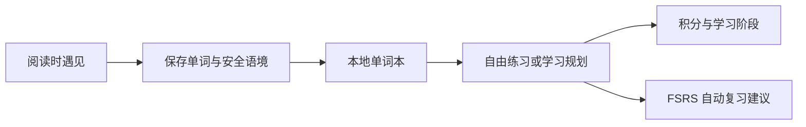

# 词遇是什么

读文章时遇见一个词，保存它所在的句子，之后再用不同方式回想。词遇把语境和练习连在一起，让单词本里留下的不只是一条孤立的翻译。

## 选择适合自己的入口

| 入口             | 适合什么场景                               | 资料归属             |
| ---------------- | ------------------------------------------ | -------------------- |
| Desktop          | 完整资料管理、学习、系统通知和目标语境采集 | 本机 SQLite          |
| Browser 独立模式 | 网页阅读、采集与完整本地学习               | 当前浏览器 IndexedDB |
| Browser 连接模式 | 保留网页遇见与采集，管理和学习在桌面完成   | Desktop 工作区       |

桌面端和浏览器独立模式都可以不设置学习规划，只用作单词本和自由练习工具。采集、普通词卡阅读与发音不会自动改变积分。

## 项目如何配合

| 项目                                                       | 负责什么                         |
| ---------------------------------------------------------- | -------------------------------- |
| [Desktop](../项目文档/leximeet-desktop/index.md)           | 桌面界面、系统能力与连接网关     |
| [Desktop Core](../项目文档/leximeet-desktop-core/index.md) | 事务、学习规则、FSRS、授权与采集 |
| [Browser](../项目文档/leximeet-browser/index.md)           | 网页阅读器、独立核心和桌面适配器 |
| [Dictionary](../项目文档/leximeet-dictionary/index.md)     | 固定版本、可校验的公共词包       |
| [LMCP](../项目文档/leximeet-connector-protocol/index.md)   | 插件与桌面的本机连接合同         |
| [LMSP](../项目文档/leximeet-sync-protocol/index.md)        | 应用 2.0.0 的独立设备同步规划    |

## 现阶段的边界

当前本机资料不上传云端，没有账号或云同步。文本词典安装后可离线使用；默认在线发音会向所选服务发送词头。浏览器与桌面连接不合并两份历史资料。

当前主要验证平台是 macOS arm64 与隔离 Chromium；正式安装流程、其他浏览器，以及 Windows/Linux 的系统通知和宿主能力，都需要分别验收。完整发布状态见[版本与路线](版本与路线.md)。
