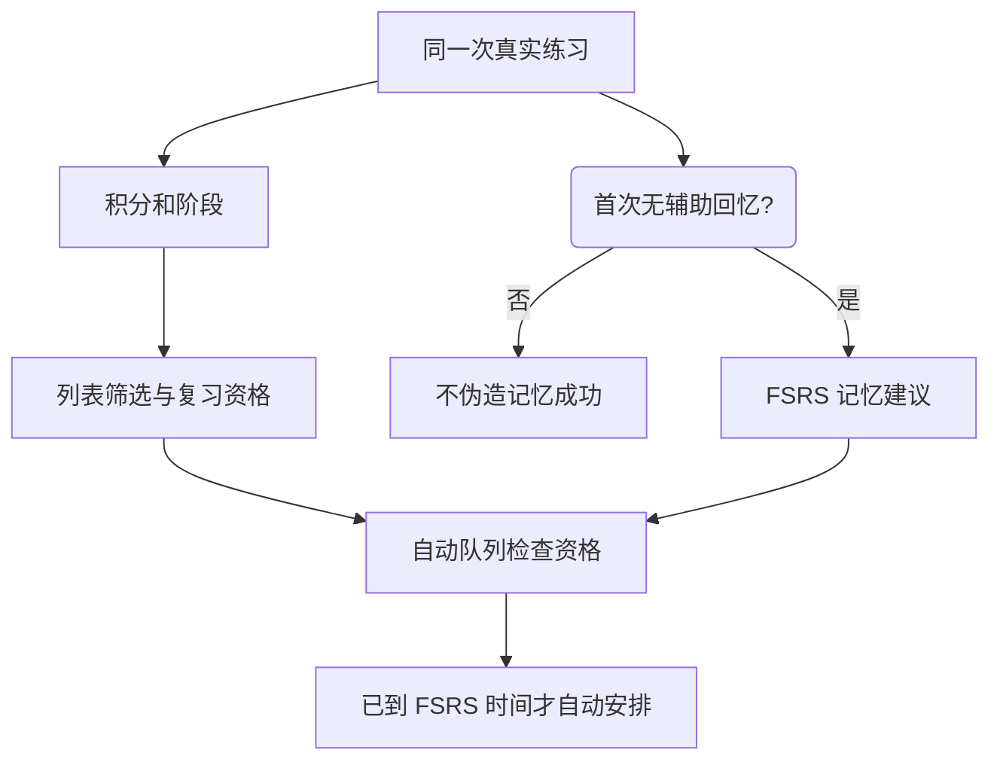

# 学习规划与练习

学习规划是「目标＋每日计划」。它是可选的：不设规划，仍然可以采集、记录和自由练习。

## 两步设定

1. 选择考试、专业主题词书，或当前本地整本词典。
2. 设置每天新学、复习和预览；Desktop 另提供提醒开关与时间范围。

保存后，整份规划一起生效；点击取消或上一步都不会提前修改当前目标。默认新学 10、复习 20；换目标保留个人记录与已有学习经历。预览估计的是初学安排，不是掌握全部单词的日期。

## 六种练习怎样记分

| 顺序 | 方式     | 首次独立正确 / 熟练反馈 |
| ---: | -------- | ----------------------: |
|    1 | 单词列表 |                      +1 |
|    2 | 看词选义 |                      +1 |
|    3 | 单词临摹 |                      +1 |
|    4 | 单词默写 |                      +2 |
|    5 | 听音辨词 |                      +1 |
|    6 | 语境填空 |                      +2 |

列表默认遮挡中文，也可切换遮挡英文。练习中的错误、不熟悉或查看遮挡答案 −1；最低 0，最高 30。同一道题只结算首次有效反馈，提示后订正不补分。普通词卡阅读、发音和采集不计分。

临摹有参考答案，能够增加练习积分，却不是独立回忆，不推进 FSRS。缺少真实释义或语境时，该题不可用。你可以切换模式或进入下一词，应用不会沿用旧题或编造选项来计分。

正确且确认保存后停留一秒，再自动进入下一词；错误留在原题。切换模式、离开、弹窗或重新开始会取消旧倒计时。重新开始创建新一轮并回到第一词，保留已经记录的积分与事件；已保存的事实不会因重练清空。

## 列表状态

新词初始 10 分，表示还未判断程度。初次达到至少 20 完成初学；达到 30 进入已熟悉休息期。

| 状态   | 含义                                               |
| ------ | -------------------------------------------------- |
| 未学习 | 尚未开始；今日任务中的词显示待学习                 |
| 学习中 | 已开始，尚未完成初学                               |
| 待复习 | 曾完成初学，当前不在熟悉休息期；到期前也能主动练习 |
| 已熟悉 | 达过 30，仍在休息期；自然衰减到 29–21 仍在这一类   |
| 不熟悉 | 当前为 0 分，是可叠加的筛选，不抹掉初学经历        |

判断一个词是否已熟悉，还要看这次休息周期是否结束，不能仅因当前积分从 30 变成 29 就把它改为待复习。

## 积分和 FSRS 各做什么

首次完成初学，最早次日自动复习。纯临摹达到 20 的词没有独立记忆，会安排首次回忆验证，不伪造 FSRS 难度或稳定性。

达到 30 后保护完整 72 小时，再每完整 48 小时减 1：第 5 天 29、第 7 天 28、第 23 天 20。自然衰减最多到 20，离线照算；主动错误可以降至 0。只有从不足 30 再次升到 30 才重新计时。

休息结束恢复复习资格，再检查 FSRS 建议时间。**有资格但未到期的词也能主动练习**：首次独立成功增加积分并计当日复习完成，但不延后原 FSRS 排期。

## 完成量与提醒

新学完成量按今天首次跨越 20 的不同词计数。复习完成量按不同词的首次独立成功计数，且该词必须已有复习资格、不在毕业当天，也不处于熟悉休息期。同词练对多题仍计一个完成词，临摹不计有效回忆复习。

Desktop 提醒默认 08:00–20:00，窗口内随机 25–35 分钟一次，平均约 30 分钟。有任务、计划和提醒开启且应用不在前台时才投递；忽略、过期或失败不计分，也不连发错过的通知。题型在「设置 → 学习提醒」，默认看词选义，可多选轮换。

macOS 通知提供选项、回复和发音动作；各 OS 能力不同，不能把六模式跨平台通知当作全部已验收。Browser 的通知权限当前主要服务连接发现，不能据此宣称拥有 Desktop 同等通知练习。

完整规范：[Core 统一学习规则](https://github.com/leximeet/leximeet-desktop-core/blob/main/docs/统一学习规则.md)、[Desktop 学习与复习](https://github.com/leximeet/leximeet-desktop/blob/main/docs/学习与复习.md)、[Browser 学习与复习](https://github.com/leximeet/leximeet-browser/blob/main/docs/学习与复习.md)。

## Desktop 的进度与预测

六种方式各自保存游标、草稿及列表完成项。重开只刷新当前模式，包含后来收录的词，其他模式仍保留原队列。预测面板依据今日实际的目标新词和近期来源顺序，展示按额度推算的初学完成曲线；查询不会生成词或成绩。批量整理、幽灵提示和完整边界见[桌面端](桌面端.md)。
