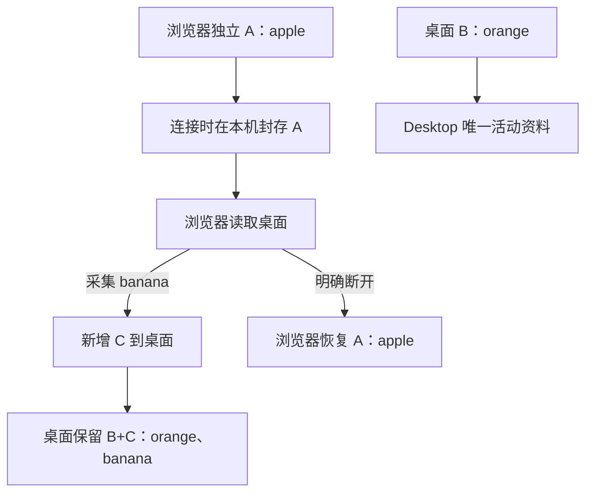

# 插件连接

连接后，浏览器是桌面资料的网页入口；桌面负责完整管理与学习。**连接不导入，也不合并浏览器原有历史。**

## 一键连接

1. 启动 Desktop 和浏览器插件，检测到对端后收到提示。
2. 在任一端发起连接，浏览器打开独立确认窗口。
3. 用户点击确认后自动配对，两端显示成功；无需抄码或填写认证信息。
4. 浏览器继续网页遇见与采集，管理和学习在 Desktop 打开。
5. 任一端明确断开后，浏览器恢复原独立资料。

收到发现提示后，仍需确认才能授权连接。通知被系统阻止时，也可以从设置页发起连接；取消或邀请过期后都不会建立连接。应用不会自动启动尚未运行的桌面端。

## 按图完成连接与采集核对

1. 保持桌面已启动，在插件管理页进入连接入口并发起一键连接。
2. 在浏览器真正的确认窗口接受邀请，等待设置页显示连接成功。认证资料自动生成，不需要复制令牌。

3. 回到普通英文网页，打开侧栏并点「分析本页」。顶部显示桌面工作区，底部显示已连接桌面端。
4. 点「采集」后选择正文中的词，核对句子，点「加入单词本」。等待反馈后，再到桌面查看。

5. 在桌面主导航进入「遇见记录」，确认单词、句子和网页来源都出现。例如下图中的两句 `node` 来自同一次连接操作；重复选择第一句没有增加第三条记录。

6. 需要恢复插件独立资料时，在任一端点「断开连接」，核对插件恢复独立状态。临时退出桌面不等于明确断开。

图中使用当前源码启动的隔离桌面和原样生产扩展。阅读图是同次无头会话的正文与原生侧栏原图并排展示，不含浏览器工具栏；桌面记录图是同一真实连接中的整窗截图。它们展示所示操作，不代替正式安装、系统通知和其他平台的验收。

## 用一个例子理解归属

apple 不会因为连接而传到桌面；banana 也不会在断开时自动带回浏览器。连接期间的新增属于桌面工作区。

## 临时失联和明确断开

临时关闭 Desktop，浏览器暂停读取和写入，等待同一桌面恢复。浏览器不会自动切回独立库，也不会把结果未确认的采集显示为已保存。用户在插件端明确断开，或插件查询原桌面得到可信的 `disconnected` 状态后，才恢复 A。撤销授权会停止读写并保持 A 封存，用户需在插件端明确断开以恢复独立使用；再次连接需要重新确认。

已连接时，插件每 5 秒检测控制状态；桌面端主动断开关闭原生端口后仍继续查证。独立且未发现桌面时每 30 秒检测，不会自动启动桌面应用。

采集结果未知时，先查询同一次操作的回执，再按原操作身份恢复。不能生成新编号重试来掩盖超时，否则可能产生两条记录。

## 连接的技术范围

当前 Browser 使用 Native Messaging，经同用户本机 Host 到 Desktop；插件不拿到 Core 私有 HTTP 令牌。协议提供阅读、采集、回执、导航和授权，不是桌面完整学习 API。

IDEA 等插件可以有不同宿主能力，但当前只是后续方向。可选反向 browser/1 能力框架存在，不代表生产浏览器已经注册网页反向操作。

详见[连接协议设计](../设计文档/连接协议.md)、[Desktop 连接指南](https://github.com/leximeet/leximeet-desktop/blob/main/docs/插件连接.md)与 [Browser 桌面连接](https://github.com/leximeet/leximeet-browser/blob/main/docs/桌面连接.md)。
