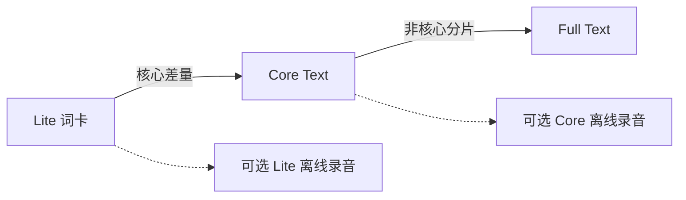

# 词典与发音

公共词包和个人资料分开。更新公共词典不覆盖用户笔记、语境、单词本或学习历史。

## 各端默认资源

| 客户端       | 默认                                   | 可选升级                       |
| ------------ | -------------------------------------- | ------------------------------ |
| Desktop      | Dictionary 0.0.3 Core Text，117,902 词 | Full Text，811,092 词          |
| Browser 独立 | Lite Text，26,417 词                   | Core Text；不安装 Full         |
| Browser 连接 | 使用 Desktop 资源与资料                | 不用本机 Lite 过滤桌面返回的词 |

Lite 保留现有 23 个学习词书的全部成员与完整入选词卡，不是把每本词书截成片段。Core 包含全部核心词卡；Full 的非核心补词不代表都有相同质量的学习内容。

消费端读取固定 Release 清单，校验字节数和 SHA-256，建立只读本地索引后，再原子切换资源。下载失败保留当前资源。`text` 表示不附离线录音，不表示去掉释义、例句或已有助记。

## 在线发音

两端默认使用有道词头发音；Desktop 还支持微软和自定义 GET/POST Provider。Browser 当前只支持公开、无凭据的 HTTPS `{word}` 模板，微软 Provider 暂不可用。阅读或配置发音说明时，需要区分各端的支持范围。

发音仅发送词头，不发送完整语境。外部服务需要网络，可能变化或失败；不承诺永久免费、永久可用。自定义服务凭据只留本设备，不进入词库或同步模型。

Dictionary 也发布 Lite/Core Audio 数据组合，但当前应用默认不打包录音；全词 Full Audio 尚未交付。不要把核心音频称作全词有声。

## 资源身份

一个公共词使用 `entry_id`，同时记录资源 release 和 entrySchema；显示词头或归一查找键不等于唯一身份。资源暂缺不应删除私人记录，后续可补回公开词卡。

下载大小不是安装磁盘占用，SQLite 索引与下载缓存另占空间。详细组合、来源和许可见[Dictionary 项目](../项目文档/leximeet-dictionary/index.md)。
