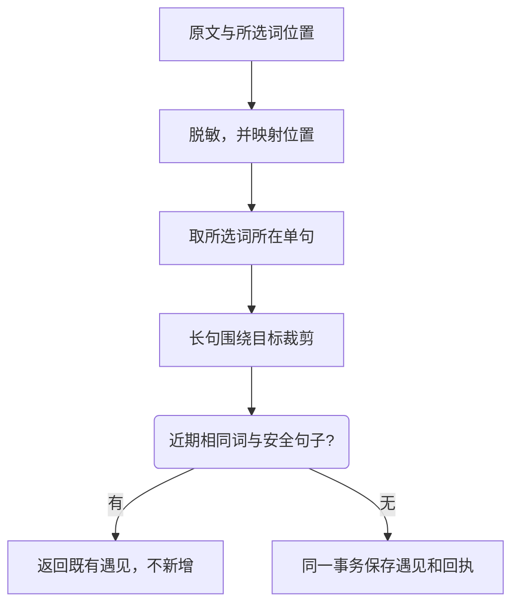

# 采集与隐私

采集会保存单词及实际语境，不增加积分。三个入口对学习目标的限制不同，但都采用相同的安全句子处理和重复检查。

| 入口               | 作用                       | 目标限制                                 |
| ------------------ | -------------------------- | ---------------------------------------- |
| Desktop 剪贴板     | 为当前学习目标积累阅读语境 | 只处理目标内英文词，无目标或未命中时静默 |
| Browser / 其他插件 | 网页等宿主中的选词和语境   | 不限目标                                 |
| 手动记录           | 主动记录额外词和语境       | 不限目标                                 |

剪贴板识别默认关闭；开启后仍会忽略密码管理器的隐私格式，不把 URL 或邮箱拆成候选。暂停每日计划不等于清除目标，目标语境仍可采集。

## 默认策略

| 设置               | 默认值             | 可调范围               |
| ------------------ | ------------------ | ---------------------- |
| 敏感内容替换       | 开启，替换为 `xxx` | 可以关闭，影响后续采集 |
| 同词同语境重复窗口 | 7 天               | 0–365 天；0 关闭       |
| 语境长度           | 500 UTF-16 单元    | 120–2000               |

例如，在 `Today is sunny. An apple arrived; contact reader@example.test. Tomorrow we leave.` 中采集 apple 时，只保存中间的安全句子；邮箱替换为 `xxx`，前后无关句子不写入。

同词不同句子可以产生另一条遇见；同词同句在七天内从不同入口再次保存，仍算重复。重复不会增加笔记、词本关系、积分、revision 或成功通知。请求编号的幂等和七天语境检查是不同保护，二者都要保留。

## 剪贴板通知

默认每个目标命中词发系统通知，用户可采集或拒绝；投递回执后计时 10 秒，默认到时采集，可改到时不采集。通知投递失败不自动保存，也不隐式弹窗；用户可以明确选择独立弹窗。

保存时再次检查目标、开关和重复，切换目标或关闭功能会撤回待处理项。响应结果未知时，沿用原操作重试，不创建新的采集操作。

插件采集真正提交到 Desktop 后，默认发送采集成功通知，可以在设置关闭。重复、失败和同事件重试不再通知；通知失败也不撤销已保存资料。

## 脱敏的真实能力

规则识别邮箱、电话、证件号、有效卡号、JWT 和有明确标签/前缀的凭据；**不能保证识别所有人名、商业秘密或所有格式的密钥**。所选词自身落在敏感值中时拒绝采集。来源标题、注释和 URL 也会一并清理，日志中不另存未脱敏的副本。

默认本机保存，不上传遥测。词卡 Markdown 只渲染安全结构和文本，不执行原始 HTML，不自动加载外部图片。Browser 连接时采用 Desktop 策略，封存的独立设置不覆盖它。

完整边界：[Desktop 采集与隐私](https://github.com/leximeet/leximeet-desktop/blob/main/docs/采集与隐私.md)、[Browser 隐私与权限](https://github.com/leximeet/leximeet-browser/blob/main/docs/隐私与权限.md)、[Core 采集策略](https://github.com/leximeet/leximeet-desktop-core/blob/main/docs/采集安全与重复语境.md)。
