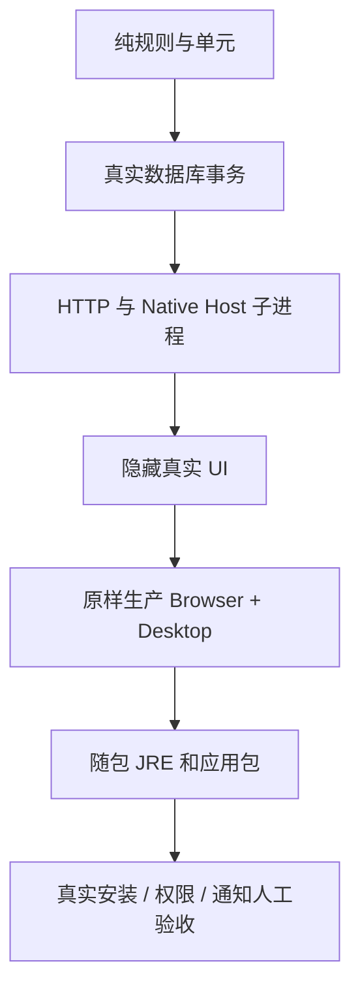

# 测试与质量

测试既要覆盖用户实际经过的链路，也要说明每层结果能证明什么。接口替身测试通过，不代表真实插件测试通过；源码测试通过，也不代表生产应用包通过。

## 主要门禁

| 层次 | 要覆盖什么                                           |
| ---- | ---------------------------------------------------- |
| 规则 | 积分、阶段、保护/衰减、FSRS、句界、脱敏与重复窗口    |
| 事务 | 原子保存、幂等、回滚、撤销重放、完成量和同词去重     |
| 协议 | 固定 Schema、预算、来源、owner、会话、撤权与未知回执 |
| UI   | 真实输入、草稿、快速切换、教学、不可用题与失败恢复   |
| 连接 | 悬浮球/侧栏采集、桌面真实资料、失联和明确断开        |
| 包   | 毒化主机 Java，验证随包 JRE/Host/词典/许可证         |

## 三段核心日常测试

1. **首次安装**：空资料、进入或跳过教学、目标和计划、首次采集与练习。
2. **七天日常**：学三天、休一天、再学三天；六模式、不同阶段、笔记、采集、换目标、提醒与重开。
3. **候选替换**：两份实际应用在同一隔离资料上替换，确认学习事件、笔记、草稿与当前结构恢复。

七天测试通过业务 Clock 推进时间，无需实际等待七天。候选替换只验证对应候选与当前 schema，不证明 0.x 测试库迁移或正式安装器升级已通过。关键学习场景包括：有资格但 FSRS 未到期的主动首答成功计当日完成，重放与重启不丢，提前成功不延长排期。

## 不抢键鼠

Desktop 自动化使用隐藏且不可聚焦的窗口，屏蔽宿主唤起，并使用受控的剪贴板与通知，默认静音。macOS 使用只读前台进程观测覆盖启动到退出，不要求辅助功能授权。禁止通过 headed/debug 打开自动 UI。

降优先级和限制并发仍有 CPU/内存开销，不能承诺后台测试零负担。真实 OS 验收可在独立测试机或虚拟机进行。

## 本站门禁

`npm run verify` 执行受控软链测试、正文链接/图表安全检查、格式和静态构建。另用 `npm run test:dev` 在新缓存、新端口真正启动开发服务，检查白屏、中文深链、图解和主题切换；`npm run test:ui` 验证本次生产预览的宽窄、明暗、导航、中文搜索和全部 Mermaid。两者不能互相替代。`dev`、`build` 与 `serve` 使用同一 `website` 根目录，防止预览与 Pages 路径不同。

操作截图清单还核对本仓原图字节、PNG 尺寸和并排图对应的两个原始表面。图片交互覆盖键盘放大、Esc/按钮/遮罩关闭、焦点恢复、快速重开、文档后退和无 JavaScript 显示；使用指南另记录宽屏与手机、明暗主题的阅读画面。截图场景只验证所操作的流程，不替代七天日常、应用包或系统通知验收。

CI 固定 Action SHA、锁定依赖并使用最小权限。本站推送/PR 只验证；手动 Pages 部署需维护者主动触发。配置检查通过不能证明远程工作流已经运行。

实际环境、数量和物料指纹由[Desktop 验收文档](https://github.com/leximeet/leximeet-desktop/blob/main/docs/测试与CI.md)、[Browser 验收文档](https://github.com/leximeet/leximeet-browser/blob/main/docs/测试与验收.md)、[Core 测试文档](https://github.com/leximeet/leximeet-desktop-core/blob/main/docs/开发与测试.md)维护，不在本站重复易变的通过数。
