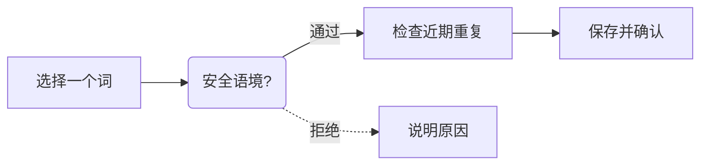

# 图表规范

图解释一个流程、关系或选择，正文解释条件与限制。优先标准 Mermaid，不把所有字段塞进节点，不把原型画面当作运行证明。参考图只说明视觉目标，不能据截图推断使用了哪一个 AI、Codex 内部功能或插件。

## 一套源码，两种展示

- **官网**：官方 VitePress 默认主题 + 本地 Vue 组件，按主题用 Mermaid 渲染标准围栏。
- **GitHub 等源码阅读环境**：其他项目的图以同源 light/dark SVG 展示，旁边可展开标准 Mermaid 源码。GitHub 自身的 Mermaid 外观由平台决定，外部 Vue / CSS 无法控制它。
- **唯一图源**：各仓 `docs/diagrams/*.mmd`，生成物在 `docs/diagrams/rendered/`；改源后重新导出，不手改 SVG。站点正文仍只写在根 `docs`。

不依赖 CDN、外部字体、AI 运行时或编辑器插件。网站运行渲染和仓库 SVG 导出共用 `diagram-theme.mjs`，避免两套参数漂移。

## 画什么，怎么拆

| 需要解释           | 图类型           | 推荐组织                   |
| ------------------ | ---------------- | -------------------------- |
| 数据去向、处理步骤 | flowchart        | 入口 → 判定 → 保存 → 结果  |
| 调用与确认先后     | sequenceDiagram  | 用户、插件、桌面等少量角色 |
| 数据实体关系       | erDiagram        | 主键、关系与少量必要字段   |
| 版本路线           | 表格或 flowchart | 已实现与未来阶段分开       |

节点写短语，边标签用一到四个词，长条件放正文。超过五六个步骤优先拆图。判断用圆角节点加 `:::decision`，全局提供虚线，不为每张图复制 `classDef`。实线表示当前路径，虚线表示可选或判断，不只依赖颜色。



这张图只讲采集主流程。脱敏范围、长度、去重时间和事务放在[采集与隐私](../使用文档/采集与隐私.md)。

## 修改已有仓库图源

1. 修改 `docs/diagrams/<id>.mmd`。对应正文块以 `<!-- leximeet-diagram: <id> -->` 标识；把其中可展开的 Mermaid 围栏同步为同一内容，保留两主题 picture 和源文件链接。
2. 更新 `sources.json` 中该图的 `sourceSha256` 为 mmd **原始字节** SHA-256；保留来源页、图序号和原始围栏 `originDiagramSha256`。后者记录原围栏 trim 后的文本范围，不能替代完整协议文件摘要。
3. 运行 `render:diagrams -- --repo`，重生成两主题 SVG 和 `rendered/manifest.json`；再运行 `check:diagrams -- --repo`。不能只改元数据，让陈旧图片通过。
4. 新增或删除图时，页中图块、sources 清单和实际 mmd 必须一起更新；检查拒绝重复、遗失和未声明图。冻结规范围栏不动，只调整图解伴随页。

将 `docs/diagrams/rendered/` 排除在 Prettier 等通用格式化之外。SVG 和生成清单保存导出的原字节，不能让格式化偷偷改变 SHA；`.mmd` 和正文是可编辑源。生成资源变更与正文、元数据一起提交，读者不需要先安装构建工具才能看到图。

## 明暗视觉与安全

| 元素       | 明亮      | 深色      |
| ---------- | --------- | --------- |
| 节点背景   | `#E4F2FF` | `#203A53` |
| 节点文字   | `#0059B3` | `#C2E2FF` |
| 细边框     | `#D1DCE8` | `#49637B` |
| 灰色连接线 | `#8B99A8` | `#A0AFBF` |
| 标签底色   | `#F5FAFF` | `#24394B` |

节点圆角 10px、1px 描边；连线细灰，标签有浅底；字体使用系统字体、15px。图保持自然字号，窄屏只在图容器内横向滚动，不把整张图缩成微小文字。

全局采用 `theme: base`、`securityLevel: strict`、`startOnLoad: false`、文本标签 `htmlLabels: false`。作者不写 init、前置配置、HTML、脚本、click 或局部样式。SVG 导出只访问本地渲染服务，拒绝外部网络。旧图的 `<br>` 在受控导出时转换成文本换行，其他 HTML 仍拒绝。时序消息与状态说明的旧换行改为纯文本分隔，保持合法的一行语法。

## 生成与验证

```bash
npm run render:diagrams -- --repo /path/to/repository
npm run check:diagrams -- --repo /path/to/repository
npm run verify
npm run test:dev
npm run test:ui
```

导出脚本使用本站锁定的 Mermaid 和已安装的无头 Chromium，不自动下载浏览器。输出 `manifest.json` 记录渲染版本、配色、每份 mmd 与亮暗 SVG 的 SHA-256；原始图和输出可对账。纯 Node 一致性检查再核验 mmd 原字节、两主题 SVG 原字节、正文 picture 目标与折叠源码；规范伴随图对照原始围栏的规范化文本，不替代合同原文件摘要核验。正式冻结的协议正文保持原字节，图解写在伴随页，不改规范以改变合同摘要。

检查中文可读、边标签不盖线、明暗有对比和手机不撑宽页面。视觉修改保留同源前后对照；运行成功不代替人眼检查。真实产品行为用明确运行方式的截图、录屏或端到端结果说明，不用流程图替代实测。
