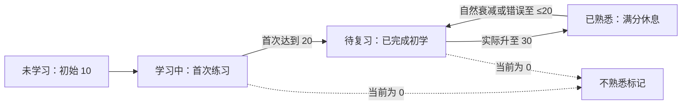
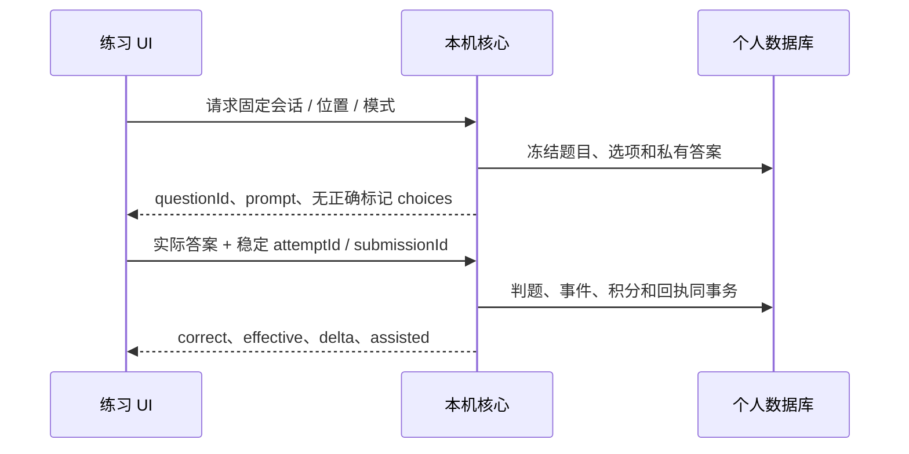

# 数据与学习规则

词遇把公共词典、用户事实、当前投影和设备设置分开。积分表示熟悉程度，学习阶段保留经历，FSRS 建议回忆时机，提醒频率控制打扰。它们共用一次练习输入，但不是同一个状态字段。

## 先分清四类数据

| 数据       | 例子                                     | 保存和更新方式                            |
| ---------- | ---------------------------------------- | ----------------------------------------- |
| 公共资源   | 单词释义、例句、词书成员                 | 固定 release / schema / SHA，个人不能写回 |
| 用户事实   | 遇见句子、真实作答、撤销、笔记、词本关系 | 稳定 ID；操作和相关实体同事务提交         |
| 可重建投影 | 积分、阶段、今日完成量、FSRS 当前状态    | 从有效事件和明确 `asOf` 时刻计算          |
| 设备偏好   | 主题、通知节流、API 凭据、系统权限       | 本机管理，不冒充学习事实或通用同步字段    |

Desktop 使用 SQLite，Browser 独立使用 IndexedDB。同步需要统一领域语义、身份与事件，但不要求两个数据库使用相同的物理表。1.0.0 连接直接读写 Desktop，当前不导入 Browser 的学习事件。

## 一个词如何被稳定识别

公共词使用 `WordRef {kind: dictionary, entryId, release, entrySchema}`；`entryId` 来自 Dictionary，词头用于显示和检索。自定义词保留 UUID、词头和语言。分片文件名、SQL 行号、网页拼写及归一词头均不能代替公共身份。

同名词、不同公共词条或个人自定义词可能有不同身份；公共词包不可用时返回缺资源，私人笔记和遇见仍保留。更新词包不应静默把历史记录换到另一个 release。

| ID / 版本                                   | 解决什么问题                               |
| ------------------------------------------- | ------------------------------------------ |
| 公共 entryId / release / entrySchema        | 哪个词条、当时依据哪个公共资源             |
| 用户实体 UUID                               | 哪个个人词、遇见或笔记                     |
| mutationId                                  | 哪一次命令；同载荷重试拿原结果             |
| eventId                                     | 哪一次遇见；不同请求也不能多保存同一事件   |
| attemptId / submissionId                    | 哪一道题、哪一次首次反馈                   |
| workspace / generation / authorizationEpoch | 哪份资料、哪一代授权；缓存不能串用户或空间 |
| 应用版本 / 规则版本 / 资源版本              | 软件交付、算法口径和词包分别管理           |

## 从 10 分到学习完成，再到熟悉

初始 10 分并不表示生词，而是尚未测试。假设用户第一次学习 `system`：

1. 尚未作答：`new`、10 分；若今日选中，额外标记待学习。
2. 看词选义独立正确：11 分、`learning`；有一条真实回忆事实。
3. 之后第一次从 19 分默写正确 +2：21 分，完成初学；保存首次毕业日，最早明日有复习资格。
4. 后续实际达到 30：进入 `mastered` 休息期。保护 72 小时，再每完整 48 小时扣 1，最低自然衰减到 20。
5. 无其他操作时第 23 天到 20：回到 `review`。还要检查 FSRS 到期时间，才进入自动队列。



分数最低 0、最高 30。不熟悉筛选是 0 分条件，可与学习中或待复习共存。已经毕业的词答错降到 10 或 0，仍保留初学完成经历，不再次占新学额度。仅凭当前分数，无法判断一个词是否未学习，也无法确定它的学习经历。

只有从不足 30 **再次实际达到 30**才重开保护计时；30→30 不重置。衰减先计算到练习发生时刻，再应用这次分数；读取不伪造答错事件。撤销满分事件时要重建整个周期，不能只把分数减回去。

## 同一次练习，两种计算

默写和语境填空独立正确 +2，其余模式 +1；首次错误、不熟悉或揭示 −1。提示后订正 0；同题首答只结算一次。采集、阅读词卡、播放发音、通知展示/忽略均不计分。

| 练习证据             | 积分                | FSRS                         |
| -------------------- | ------------------- | ---------------------------- |
| 独立成功或列表熟练   | 按模式加分          | Good；提前成功不延后现有排期 |
| 独立失败或列表不熟悉 | −1                  | Again，可以拉回短期巩固      |
| 临摹                 | 正确可 +1           | 不证明独立回忆，不虚构 S/D   |
| 揭示 / 辅助订正      | 揭示 −1，订正不补分 | 不推进独立回忆排程           |
| 通知投递 / 忽略      | 0                   | 没有练习事件                 |

FSRS-6 依据真实回忆估计记忆的稳定性和难度，不依据「通知弹过几次」更新。词遇固定算法配置、保持率与规则版本；两端通过共享规则和 FSRS 向量核对结果，不能只检查同名字段。

## 复习资格、到期和当日完成

首次毕业资格是学习时区的下一个自然日零点；满分休息结束资格是实际降至 20 的时刻。自动候选同时满足资格和算法建议：

```text
automaticDueAt = max(reviewEligibleAt, fsrsDueAt ?? firstRecallDueAt)
候选 = 阶段为 review 且 now >= automaticDueAt
```

没有独立回忆的临摹毕业词，用首次回忆验证时间，不伪造 FSRS 状态。每天复习额度限制自动安排数量；用户随时可以自由练习。

例如明天已有复习资格，但 FSRS 建议三天后提醒：明天主动首次无辅助答对，积分增加，**当日复习完成 1**；原 FSRS 时间不延后，也不会因此提前进入自动队列。同日再答对同词，完成量仍是 1。临摹、辅助订正、失败、毕业当天和熟悉休息期不冒充有效复习完成。实时写入和事件重放使用相同口径。

每日新学完成按当天第一次跨越 20 的不同词计；复习完成按有资格的独立成功不同词计。完成数量是投影，不能把两台设备的最终数量直接相加。失败词可短期巩固，即使当天已完成，也不会二次增加完成量。

## 题目、事务与回执



UI 不提交权威分数，不靠前端判断的 `correct` 结算。相同提交同内容返回原回执，换内容冲突；响应未知先恢复同一结果。辅助揭示也先提交事件，不能换提交 ID 把同题订正当作独立首答。

事件全序按 `(logicalClock, deviceId, deviceSeq, entityId)` 排列，十进制逻辑序号按数值比较。撤销保留原事件并重放；分数、阶段、满分周期和 FSRS 一起重建。比较跨端结果时，契约、有效事件、水位和 `asOf` 都必须相同，不能直接比较读取时刻不同的两份缓存。

## 当前结构与未来同步

Desktop 当前个人数据库使用 schema 100；Browser 独立资料使用明确版本的 IndexedDB，只保留 `meta`、`words`、`encounters`、`reviews`、`practice`、`notebooks` 六个 store。完成额度从练习事件计算，不另存规划完成表。个人编辑只支持笔记和多个单词本关联，公共释义只读。

未发布的旧库不转换、不双读；旧格式或未知结构拒绝打开并保留原资料。首发前的试验格式不属于正式兼容范围。正式发布后的资料升级、回滚与跨版本兼容需要独立设计和真实升级验证；当前模型以 [Browser架构与数据](https://github.com/leximeet/leximeet-browser/blob/main/docs/架构与数据.md)为准。

2.0.0 要处理稳定实体身份、设备事件、逻辑时钟、撤销和并发编辑。公共资源缺失不删除用户事实；本地连接的 owner 与云端账号是不同边界。Browser 当前 normalized 唯一索引还需在云同步前改造；当前本机连接已经用 Desktop 的权威 WordRef。

具体字段、时间边界和回归向量以 [Core 统一学习规则](https://github.com/leximeet/leximeet-desktop-core/blob/main/docs/统一学习规则.md)、[Browser 学习规则](https://github.com/leximeet/leximeet-browser/blob/main/docs/学习与复习.md)和 [Desktop 学习与复习](https://github.com/leximeet/leximeet-desktop/blob/main/docs/学习与复习.md)为准。本站提供跨项目解释，不维护第二套可独立修改的规范。
