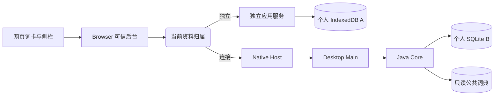
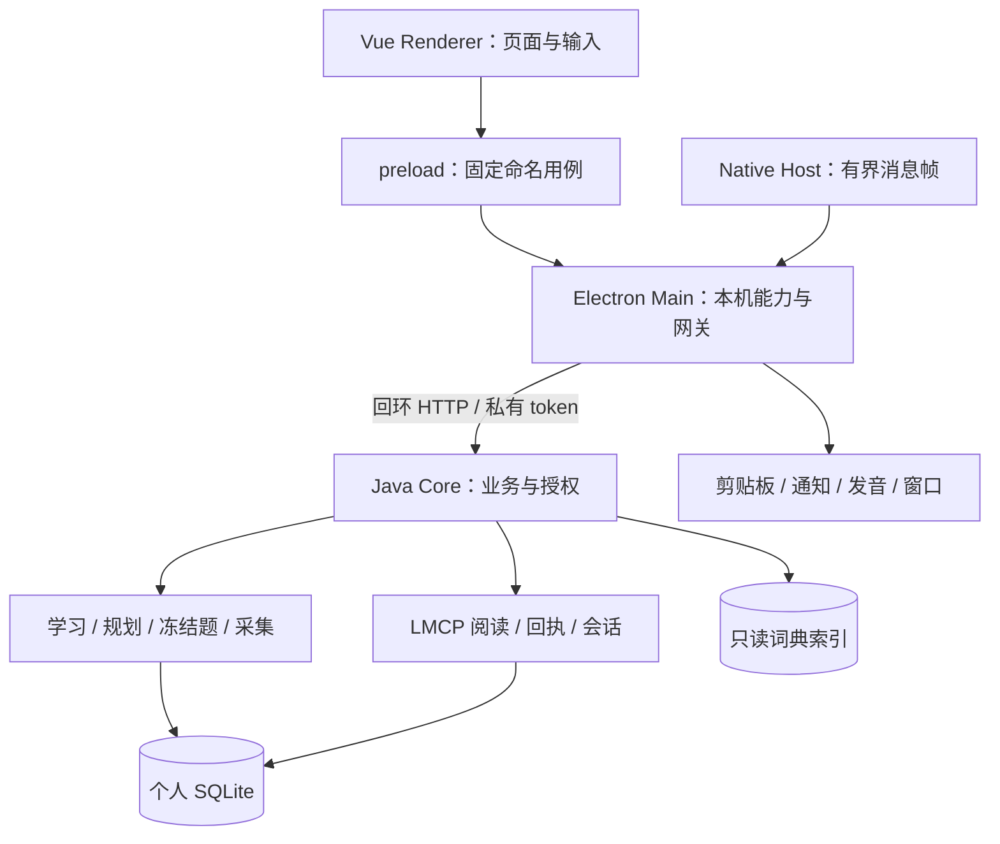

# 系统架构

词遇以「谁保存资料、谁决定业务结果」划分模块。Desktop 是完整学习工作区；Browser 既能独立使用，也能切换成桌面的网页阅读入口。公共词典只读，个人资料本地保存，1.0.0 没有云账号或云同步。

## 一次网页采集经过哪些地方

假设用户在文章中遇到 `system`，点击侧栏的采集按钮。独立运行时，后台把资料保存在浏览器数据库中；连接桌面后，界面仍是同一个按钮，后台则改用 Desktop 的接口。

网页只提供出现位置、句子和用户动作，不持有私人数据库或配对密钥。Core 成功提交后才返回回执；桌面随后可以发送系统通知。通知失败不撤销已保存的资料，按钮成功不依赖通知是否显示。

## Desktop 的进程与责任

| 边界        | 做什么                                  | 为什么这样分                             |
| ----------- | --------------------------------------- | ---------------------------------------- |
| Renderer    | 展示结果、保存草稿、串行提交与切换      | UI 不能把自报的「答对」当成学习事实      |
| preload     | 固定 channel、有限 DTO、导航确认        | 不给页面任意 IPC、shell 或文件路径入口   |
| Main        | 管 Core 生命周期、系统能力、Native 网关 | 操作系统权限集中管理，不写第二份积分算法 |
| Native Host | Native Messaging 与同用户传输           | 插件不需要 JDK、系统 Node 或 Core token  |
| Core        | 校验答案、权限、身份；事务、回执、投影  | 一次操作只有一个写入者和一个最终结果     |
| 公共词典    | 词头、释义、词书及可重建索引            | 更新词包不应清空笔记、遇见和学习历史     |

当前实际本机 IPC 验收使用 macOS UDS。Core 私有 HTTP 只监听回环并拒绝网页 Origin；真实插件来源由 Native 连接传入，而不是信任消息正文自报来源。Renderer、插件和网页都拿不到 Core token。

## Browser 的两种核心适配

Browser 的功能层保留浮球、网页词卡、侧栏和按句采集。独立模式有本地学习、规划、笔记等应用服务；连接模式换成 ReadingPort/CapturePort，管理入口会提示用户到桌面操作。这个切换过程不复制 SQLite 表到 IndexedDB，也不会把每个按钮都公开为远程 API。

| 运行方式 | 业务真源         | 可写的个人资料             | 管理和学习   |
| -------- | ---------------- | -------------------------- | ------------ |
| 独立     | Browser 应用服务 | 独立资料 A                 | 插件工作区   |
| 连接     | Desktop Core     | 桌面资料 B                 | Desktop      |
| 临时失联 | 等待原 Desktop   | A 继续封存；不偷偷兜底写入 | 显示恢复状态 |
| 显式断开 | Browser 应用服务 | 恢复原 A                   | 插件工作区   |

连接成功后采集 C 写到桌面：**连接前 A / B → 连接时封存 A、使用 B+C → 断开后恢复 A、桌面保留 B+C**。这是资料归属切换，当前没有首次导入或合并。

## 三条不同的数据流

1. **读取**：匹配词头 → 有界词卡 DTO → 绑定 owner 的短租约 → 资料 revision 改变后刷新。私人缓存不能跨工作区、世代或授权代次复用。
2. **写入**：实际动作 + 稳定操作 ID → 校验与事务 → 持久回执 → UI 更新。超时后先确认同一操作的结果，不更换 ID 重写。
3. **宿主能力**：插件可注册自己实际支持的受限能力，桌面按授权调用。Browser 生产入口当前未注册反向网页能力；存在 Schema 不代表可控制网页。

学习中心使用 Desktop 内部用例，不走 LMCP；LMCP 1.0.0 公开的是阅读、采集、连接控制和固定导航。云端同步未来使用 LMSP，不把 `getChanges` 当作整库同步接口。

## 对应源码

| 项目    | 关键入口                                                                                           |
| ------- | -------------------------------------------------------------------------------------------------- |
| Desktop | `frontend/src/desktop/DesktopShell.vue`、`practice-session.js`：路由和练习生命周期                 |
| Desktop | `electron/preload/bridge.js`：固定用例；`electron/services/lmcp/gateway.cjs`：连接网关             |
| Desktop | `electron/services/study-reminder.cjs`、`study-notifications.cjs`：设备提醒                        |
| Core    | `DesktopPractice` / `DesktopLearningReplay`：判题与重放；`LmcpService` / `LmcpReading`：授权与采集 |
| Browser | `entrypoints/`、`page/`、`ui/`：扩展边界与阅读界面                                                 |
| Browser | `lib/application-services.ts`、`desktop-reading.ts`、`connector/`：本地应用与桌面适配              |

继续阅读：[数据与学习规则](数据与学习规则.md)、[功能设计](功能设计.md)、[部署与扩展](部署与扩展.md)。完整实现以 [Desktop 架构](https://github.com/leximeet/leximeet-desktop/blob/main/docs/架构与数据模型.md)、[Browser 架构](https://github.com/leximeet/leximeet-browser/blob/main/docs/架构与数据.md)和 [Core 文档](https://github.com/leximeet/leximeet-desktop-core/tree/main/docs)为准。
