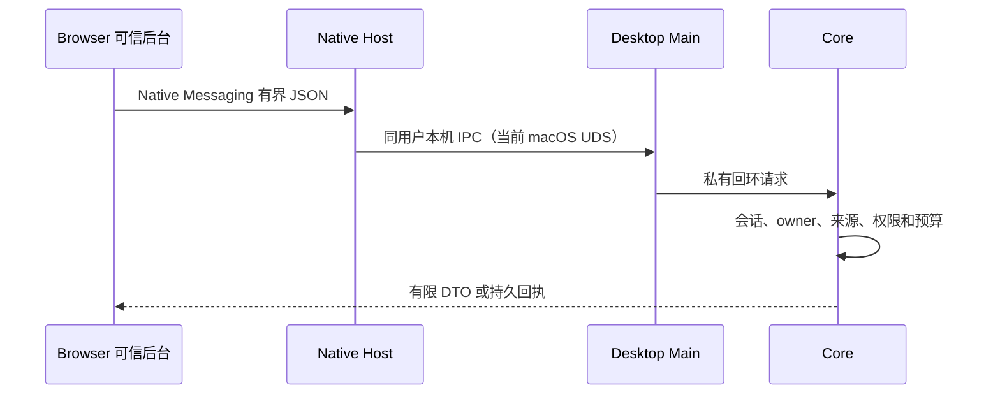

# 连接协议

LMCP 是插件使用 Desktop 资料的基础合同，限定了可调用的接口范围；它不提供通用 RPC，也不公开桌面完整业务核心。协议仓维护消息、权限、预算、错误和恢复语义；消费者自行实现适配器。

## 方法范围

| 能力       | 典型方法                                                                 |
| ---------- | ------------------------------------------------------------------------ |
| 发现与授权 | hello、requestConnection、pair、resumeSession、disconnect、revokePairing |
| 阅读       | getWorkspace、matchWords、getWord、getPublicEntry、getChanges            |
| 采集和恢复 | recordEncounter、getOperation                                            |
| 桌面导航   | openInDesktop                                                            |
| 可选       | listNotebooks、listEncounters、registerHost                              |

16 项必需、3 项可选。远程练习、FSRS、规划编辑、笔记/标签修改和首次合并不在 1.0.0 API 中。browser/1 的反向能力由插件按实际实现注册、按项授权，不能因为有 Schema 就宣称产品功能已实现。

## 本机传输

Core 令牌不交给插件，内容脚本不持有配对和会话凭据。读取缓存绑定 pairing、设备、workspace、generation 和授权代次，不只绑定词 ID；断线和撤权使私人在线展示失效。

## 安全与恢复

- 所有方向上限 262,144 字节 UTF-8 JSON，批量最多 100 项且同时满足字节预算。
- 拒绝重复 JSON 键、孤立代理项和非有限数值；stdout 仅协议帧，日志走 stderr。
- 读取默认 5 秒、普通写 15 秒；超时是结果未知，不是确认未保存。
- mutationId 标识一次命令，eventId 标识一次遇见；同 ID 同载荷恢复原结果，异载荷冲突。
- 一次邀请 120 秒；长期配对、短会话和最多 30 秒读取租约分别管理。
- 导航使用固定 target，不能接受任意文件、URL 脚本或 shell。

正式 1.x 连接按 API major、最低版本和必需能力协商，不因可选扩展或完整摘要不同拒绝合法客户端。Core 与 Browser 已实现这套检查，并分别测试版本、能力与摘要的接受和拒绝分支；任一端使用预发布候选时，仍要求候选版本和摘要相同。这些回归不代表未来各版本、各平台的实机互操作已经验收。

协商远端版本与核验本端发行物是两件事。消费者要按固定清单验证随包协议、Core 和 Native Host 的来源字节；即使能够连接，也不能动态消费另一仓库的工作树、接受缺失许可的物料或替换物料。

## LMCP 与 LMSP

LMCP 服务同一机器的资料使用与宿主能力；LMSP 服务应用 2.0.0 的独立设备同步。读取 revision/getChanges 只是刷新提示，不下发整库事件或计划，不能当成云增量复制。

正式合同、完整参数和正反向量见 [LMCP 项目](../项目文档/leximeet-connector-protocol/index.md)；本站不复制一份可能漂移的完整 API 表。
