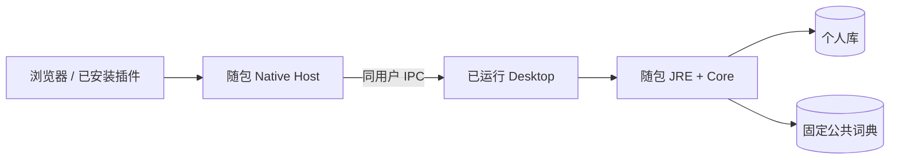

# 部署与扩展

1.0.0 的运行单位是一台用户设备，没有必须部署的云服务。Desktop 带本机核心与资源，Browser 可独立安装；连接只在本机可信通道上使用桌面资料。

## 三种交付物如何启动

| 交付物         | 运行依赖                                         | 资料在哪里               |
| -------------- | ------------------------------------------------ | ------------------------ |
| Desktop 应用包 | 随包 Electron、JRE、Core JAR、词典和 Native Host | 应用的个人工作区         |
| Browser 插件包 | 支持的浏览器及扩展权限；独立词包                 | 该浏览器的隔离 IndexedDB |
| 文档站         | 静态 HTML、JS、CSS、图片；无需业务服务器         | 不存用户单词，不接遥测   |

开发环境需要 Node/JDK/Maven，与最终用户安装包的运行依赖分开。不能把「开发机可以启动」当成随包运行已经验收，也不能把源码里有 Windows/Linux 分支当成各平台安装和通知已验收。

Native manifest 登记精确扩展来源。正式安装检测实际浏览器；隔离测试只登记本轮配置，避免修改用户日常资料。插件发现不授予数据访问，也不拉起尚未运行的桌面。

## 发布时验证什么

| 层次         | 核验对象                                              | 不能替代的证据         |
| ------------ | ----------------------------------------------------- | ---------------------- |
| 单元 / 事务  | 规则、首答、撤销、重复语境、授权、回执、重启          | 真实 OS 窗口和客户端   |
| 来源与物料   | Git 提交、冻结协议逐文件 SHA、Core gitlink、JAR、词典 | UI 表面能打开          |
| 真实源码联调 | Browser 后台 → Native → Main → Java → SQLite          | 随包 JRE 和安装路径    |
| 实际包联调   | 经检查的同一应用包、同一插件生产字节                  | 后续重新构建的另一个包 |
| 系统人工验收 | 通知权限、声音、安装体验及平台差异                    | mock 通知回调或截图    |

发布包保留自有 AGPL 全文、源码取得信息和依赖原许可，包括 Electron、JRE、字典来源、JAR 三方说明与 SBOM。测试记录应链接所属仓权威结果，不能仅展示「CI 配置存在」。正式上传、商店或签名发布由维护者另行授权。

## 加一个插件，如何避免重复实现桌面核心

以未来 IDE 插件为例，它负责编辑器词卡和选区语境，不另公开一套远程学习规划接口。

1. 功能层依赖自己的阅读和采集端口，不直接引用数据库或连接票据。
2. 独立使用（若产品支持）由本地应用服务实现端口；连接桌面由 LMCP 适配器实现。
3. 实现 hello、真实确认、会话恢复、owner 绑定、只读租约、稳定操作 ID 与未知结果对账。
4. 遵循公共 WordRef 和 UTF-16 出现范围；连接后使用桌面采集政策，不按插件词典缺失过滤桌面候选。
5. 编辑器特有能力单独注册、逐项授权。没有浏览器标签页能力，不需要伪装支持 browser/1。
6. 用实际宿主测试连接前后、临时失联、断开恢复及采集；再运行真实 Desktop 联调。

这里描述接入方式，不代表 IDEA 已完成。LMCP 规范约束共同边界，插件自行实现适配；桌面保持唯一写入者，不给任意脚本、文件或 shell 调用通道。

## 2.0.0 云同步需要另一个边界

独立 Browser 与 Desktop 在云同步中将各自作为一个设备，把个人事件上传云端。它与本机连接不同：本机连接封存 A；云同步则需要用户选择覆盖或合并，处理两个设备都有的事实。

公共词包作为可校验资源不整包上传；个人记录保留稳定词引用，即使某设备缺词包也不能删除遇见或笔记。同步需统一事件身份、逻辑顺序、撤销和规则投影，不能仅让两端表字段同名，也不能相加最终积分。Browser 独立目前还有 normalized 唯一身份约束，正式云同步前需改造。

云端账号、LMSP 传输、分批上传、冲突和服务器权威等仍是路线。详细方案以 [LMSP 项目](../项目文档/leximeet-sync-protocol/index.md)及各项目未来实现文档为准。
