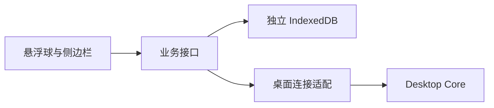

# LexiMeet Browser

浏览器插件把网页上的单词与语境带入词遇。它支持独立本机使用，也可以连接桌面端成为网页阅读与采集入口。

## 两种运行方式

| 独立运行                             | 连接桌面                   |
| ------------------------------------ | -------------------------- |
| 资料保存在浏览器 IndexedDB           | 业务读写调用桌面 LMCP 服务 |
| 管理页支持学习规划、练习、词库和笔记 | 管理入口提示转到桌面应用   |
| 使用本地 Lite/Core 公共词典          | 以桌面词典和资料为准       |
| 独立资料 A 可继续维护                | A 被封存；显式断开后恢复   |

临时断线不会自动切回独立资料。读写失败需要显示明确反馈，未确认的提交应通过幂等收据查询结果。



## 开发

```bash
git clone https://github.com/leximeet/leximeet-browser.git
cd leximeet-browser
npm ci
npm run lab:browser
```

实验命令使用隔离浏览器配置。插件商店发布与仓库构建是不同环节；可加载仓库构建的 unpacked 扩展，安装步骤见[快速开始](../../使用文档/快速开始.md)。

本机使用头像、即时词卡、悬浮球与侧边栏切换、按句采集、上下文去重和脱敏，都是阅读交互的一部分。连接测试必须同时检查插件反馈和桌面持久化资料。

- [源码与 README](https://github.com/leximeet/leximeet-browser)
- [仓库文档](https://github.com/leximeet/leximeet-browser/tree/main/docs)
- [浏览器插件使用](../../使用文档/浏览器插件.md)
- [连接桌面](../../使用文档/插件连接.md)
