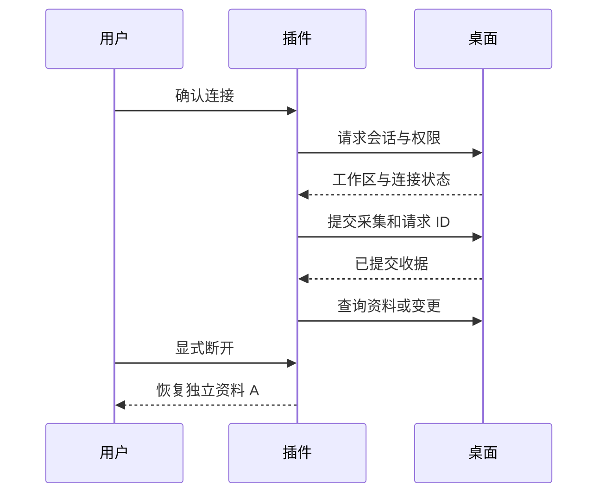

# LexiMeet Connector Protocol（LMCP）

LMCP 约束插件与本机桌面端之间的业务接口、权限和连接流程。仓库是协议规范、Schema、示例与一致性测试的来源；它本身不是桌面运行时，也不是浏览器扩展。

## 1.0.0 定义的边界

- Desktop 是已连接工作区的数据拥有者。
- 插件通过规范业务接口读取单词与语境、提交采集，不直接访问桌面数据库。
- 独立资料 A 封存，连接时使用桌面 B；新增资料 C 保存到桌面，断开恢复 A。
- 配对确认、会话权限、幂等请求、收据查询和变更游标都需要实现。
- 插件特有能力按适配命名空间扩展；浏览器可选接口不等于所有插件都必须实现。

## 扩展方式

通用接口与插件特有接口分别演进。规范列出的可选浏览器能力，不代表生产插件已经注册这些能力；实现者需要在握手中报告实际支持范围。修改公共 Schema 或学习语义前，先协调协议与两端测试向量。

正式协议文件与冻结清单在仓库中维护，文档站只作解释，不复制另一套规范。完整接口与预算见[连接协议](../../设计文档/连接协议.md)。

正式规范的个人内容只保留笔记与单词本关联，不接受`meaningSupplement`或自定义标签。消费端必须同时更新DTO、适配、冻结原字节和严格Schema测试，不能只替换合同摘要；某两端可以互联也不代表已满足最新规范。准确的消费来源与验证范围见各仓发布记录及[LMCP验证范围](https://github.com/leximeet/leximeet-connector-protocol/blob/main/docs/验证范围.md)，使用截图不替代正式包互操作验证。

- [规范仓库](https://github.com/leximeet/leximeet-connector-protocol)
- [协议文档](https://github.com/leximeet/leximeet-connector-protocol/tree/main/docs)
- [实现与规范的分工](../../设计文档/系统架构.md)
