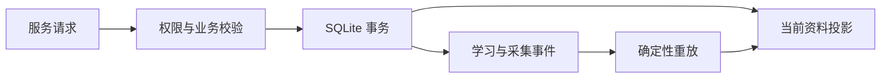

# LexiMeet Desktop Core

Core 是 Java 21 实现的本机数据与业务核心。桌面界面和连接插件通过服务调用读写资料，界面不直接操作数据库，也不自行决定练习记分。

## 核心职责

- 保存用户单词、单词本、笔记、遇见语境和学习规划。
- 冻结题目、判定首答和辅助行为，记录学习事件并投影积分、状态和当日完成量。
- 计算 FSRS 建议和被动提醒候选，执行熟悉词衰减。
- 查询公共词典，按词条 ID 引用资料。
- 实现 LMCP 权限、幂等收据和变更序号。



## 数据约束

个人库和只读公共词典是两个数据库。公共词典升级不能清空学习记录；用户关系通过稳定词条引用关联。积分、学习阶段和 FSRS 不是同一个字段，详见[数据与学习规则](../../设计文档/数据与学习规则.md)。

练习提交成功后才推进界面。相同请求重试返回收据，不重复记分；撤销时通过事件重放重新计算结果，不能直接对当前分数反向加减。

## 本地验证

```bash
mvn verify
python3 scripts/verify-docs.py
```

使用 JDK 21 和 Maven。构建会检查格式、执行单元与事务测试并生成可运行 JAR 和 SBOM。完整命令、Core 基础 API 的使用边界及桌面消费者接口以仓库文档为准。

- [源码与 README](https://github.com/leximeet/leximeet-desktop-core)
- [统一学习规则](https://github.com/leximeet/leximeet-desktop-core/blob/main/docs/统一学习规则.md)
- [仓库文档](https://github.com/leximeet/leximeet-desktop-core/tree/main/docs)
