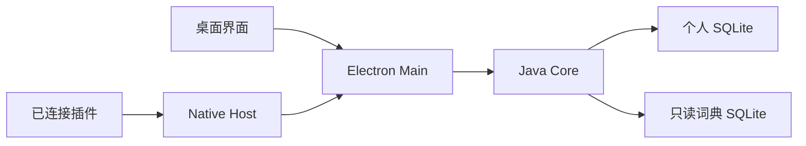

# LexiMeet Desktop

桌面端是本机学习工作区。它提供完整的学习、词库管理和采集功能，也在插件连接后提供权威数据服务。

| 组成                | 职责                                                               |
| ------------------- | ------------------------------------------------------------------ |
| Vue 界面            | 学习规划、六种练习、词库、笔记、遇见记录、设置和教学               |
| Electron Main       | 窗口、系统剪贴板、通知、快捷键、发音、插件连接和本地 Core 生命周期 |
| Desktop Core 子模块 | 用户资料、练习判定、事件投影、FSRS、词典查询和 LMCP 服务           |



## 开发与验收

```bash
git clone --recurse-submodules https://github.com/leximeet/leximeet-desktop.git
cd leximeet-desktop
bash scripts/test-desktop.sh
```

需要 Node.js 24+；脚本准备受控的 JDK 21、Core 和隔离资料目录。使用 `--connected` 启动浏览器插件联调环境。人工验收命令会显示窗口，日常自动化测试使用后台环境，详见[环境与联调](../../开发文档/环境与联调.md)。

## 本地安装候选

先提交 Desktop/Core 改动并确认 Core checkout 与固定子模块一致，再从 Desktop 仓库运行 `npm run release:local`。命令构建本机安装器并执行隔离安装启动检查，输出到独立的 `release/<版本>/<平台与架构>/<构建时间>/`；每轮附带 `BUILD-MANIFEST.json` 和 `SHA256SUMS`，记录源码、资源、实际物料和验证状态，不覆盖旧候选。

应用携带裁剪后的 JRE、Native Host 和 LexiMeet Dictionary Core Text。正式资料保存在稳定的 `workspaces/v1` 空间，开发与验收使用隔离目录；旧未发布试用库原地保留。安装、签名和启动排障以 [Desktop本地打包与安装](https://github.com/leximeet/leximeet-desktop/blob/main/docs/本地打包与安装.md)为准。

## 当前边界

1.0.0 包含本地连接和本机资料管理。正式词典运行链使用 LexiMeet Dictionary 0.0.3，旧 ECDICT 独立资源及翻译/内容包接入已停用；聚合词典自身的数据来源许可仍保留，见 [Desktop依赖与源码范围](https://github.com/leximeet/leximeet-desktop/blob/main/docs/依赖与源码范围.md)。账号、云同步和 LMSP 运行时属于 2.0.0 路线。跨平台打包与 macOS 实机验证分开记录，不能用单元测试代替系统通知、权限和安装验证。

- [源码与 README](https://github.com/leximeet/leximeet-desktop)
- [仓库文档](https://github.com/leximeet/leximeet-desktop/tree/main/docs)
- [系统架构](../../设计文档/系统架构.md)
- [桌面端使用](../../使用文档/桌面端.md)
