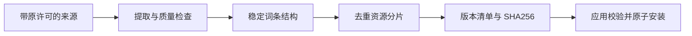

# LexiMeet Dictionary

词典仓库构建带版本、校验值和来源信息的公共资源包。词典不保存用户的学习进度、笔记或遇见记录。

## 当前资源

词典 0.0.3 是当前应用使用的资源版本；它与桌面和插件 1.0.0 的应用版本独立。

| Text 包 |  词条数 | 主要用途                                             |
| ------- | ------: | ---------------------------------------------------- |
| Lite    |  26,417 | 浏览器轻量独立运行，保留完整的 23 本单词书目录与成员 |
| Core    | 117,902 | 桌面默认词典，浏览器可增量升级                       |
| Full    | 811,092 | 桌面扩展查询，通过增量分片安装                       |

Text 表示不附带音频文件，不表示只有拼写或没有释义。音频资源包与在线发音接口是两种独立方案。

## ID 与升级

应用使用词条 ID 关联用户资料，`lookupKey` 用于检索，不能把显示拼写当作全局关系主键。`leximeet.entry.v2` 和 `leximeet.release.v3` 描述当前词条与资源清单结构；具体 Schema 以仓库为准。

各端公共资源版本可以短时不同。连接模式使用桌面查询；未来云同步同步的是个人事件和关系，不能因为本端词典缺少某条资料而删除云端个人记录。

## 来源与许可

资源引用 Wiktionary、ECDICT、Qwerty Learner 等来源，具体数据、音频和代码保留各自许可及来源清单。词遇自有代码的 AGPL 许可不能覆盖第三方资源许可。新增候选数据必须先经过质量和许可检查。

- [源码、资源清单与发布入口](https://github.com/leximeet/leximeet-dictionary)
- [仓库文档](https://github.com/leximeet/leximeet-dictionary/tree/main/docs)
- [词典与发音](../../使用文档/词典与发音.md)
