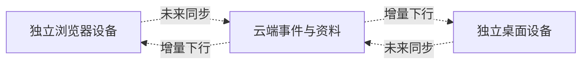

# LexiMeet Sync Protocol（LMSP）

LMSP 是未来设备与云端交换个人资料的协议规划。当前仓库目标版本为 1.0.0，规范仍是 RC 阶段；桌面与浏览器 1.0.0 的本地连接不依赖云同步上线。

## 与 LMCP 的区别

| LMCP                     | LMSP                             |
| ------------------------ | -------------------------------- |
| 本机桌面拥有已连接工作区 | 多个独立设备与云端交换资料       |
| 连接后插件使用桌面数据   | 每个独立设备仍有自己的资料与投影 |
| 不导入封存的插件资料 A   | 后续需要用户选择云覆盖或合并     |
| 当前 1.0.0 本地连接使用  | 应用 2.0.0 路线，尚未上线        |

## 已确定的方向

稳定实体与事件 ID、幂等批次、删除标记、增量游标和可重放学习事实是跨设备一致性的基础。同步由用户主动发起；大量历史记录按最近三天、七天及更早的时间段分批上传，避免单个包过大。首次登录需要明确选择云端覆盖或合并，合并策略按云端优先设计。

公共词典包不上传为个人资料。不同公共资源版本不能造成个人遇见或笔记丢失。认证、冲突处理、数据配额与真实多设备测试需在云端阶段完成。

- [规范与路线仓库](https://github.com/leximeet/leximeet-sync-protocol)
- [产品版本路线](../../产品文档/版本与路线.md)
- [数据与学习规则](../../设计文档/数据与学习规则.md)
